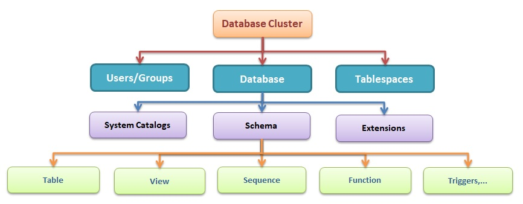

# PostgreSQL Theory

## Overview

## Chi tiết về PostgreSQL

### Các thành phần chính trong PostgreSQL

- PostgreSQL tổ chức dữ liệu theo một cấu trúc phân cấp rõ ràng, bao gồm cluster, database, schema, table,...

    

**1. Cluster**

- Cluster là đơn vị lưu trữ lớn nhất trong PostgreSQL, là một tập hợp các cơ sở dữ liệu được quản lý bởi một server PostgreSQL.

**2. Database**

- Database là một tập hợp các schema, mỗi schema chứa các table và các đối tượng khác.
- Mỗi database trong PostgreSQL là một thực thể độc lập với các schema và table riêng.
- Các database khác nhau trong cùng một cluster không chia sẻ dữ liệu trực tiếp với nhau.
- Người dùng sẽ phải kết nối đến một database cụ thể khi sử dụng PostgreSQL.
- Khi PostgreSQL được khởi tạo, mặc định sẽ có 3 database được tạo ra, `template0` và `template1` là các database mẫu cho việc tạo database mới còn `postgres` là database mặc định trong PostgreSQL.
- Kết nối và chuyển đổi database
    ```sgl
    -- Hiển thị tất cả databases
    \l

    -- Kết nối đến database
    \c ten_database
    ```
- Tạo database mới
    ```sql
    CREATE DATABASE database_name;
    ```
- Xóa database
    ```sql
    DROP DATABASE database_name;
    ```
    - Chỉ những user sở hữu database hoặc superuser mới có quyền xóa database đó.
    - Xóa 1 database cũng sẽ xóa sạch tất cả các đối tượng chứa trong database đó.
    - Không thể thực thi câu lệnh `DROP DATABASE` khi ta đang kết nối đến database cần xóa. Cần phải kết nối đến một database khác rồi mới tiến hành thực thi câu lệnh xóa database kia.

**3. Schema**

- Schema là một không gian chứa các đối tượng trong cơ sở dữ liệu như table, view, index,...
- Schema giúp tổ chức, quản lý và nhóm các đối tượng trong database theo logic.
- Các đối tượng ở các schema khác nhau có thể có cùng tên mà không gây xung đột.
- Mặc định, PostgreSQL tạo một schema có tên `public` cho mỗi cơ sở dữ liệu mới.
- Tạo một schema mới
    ```sql
    CREATE SCHEMA schema_name;
    ```
- Xóa một schema
    ```sql
    -- Chỉ xóa schema nếu nó trống
    DROP SCHEMA schema_name;

    -- Xóa schema và tất cả các đối tượng trong nó
    DROP SCHEMA schema_name CASCADE;
    ```
- Để truy cập 1 đối tượng trong schema, ta dùng cấu trúc `<tên Schema>.<tên đối tượng>`.
- `search_path` là tham số quy định danh sách schema mà PostgreSQL sẽ sử dụng để tìm hay tạo 1 đối tượng nào đó khi chúng ta không chỉ rõ schema.
    ```sql
    SHOW search_path ;
    ```
    ```
       search_path   
    -----------------
     "$user", public
    (1 row)
    ```
    - Như ta thấy, `search_path` là 1 danh sách bao gồm: `$user` tức là tên user đang kết nối vào, tiếp theo là `public`. Điều đó có nghĩa là, nếu ta tạo 1 đối tượng mà không chỉ ra schema, PostgreSQL sẽ cố gắng tìm schema có tên trùng với user mà ta dùng để đăng nhập trước đó để đặt đối tượng vào đó, nếu schema đó không tồn tại, nó sẽ tạo đối tượng ở schema tiếp theo trong `search_path`, đó là `public`.
    - Để thay đổi `search_path`, ta dùng câu lệnh
    ```sql
    SET search_path TO schema1, schema2, public;
    ```

**4. Table**

- Table là đối tượng lưu trữ dữ liệu trong PostgreSQL, mỗi table sẽ có một cấu trúc xác định với các cột và kiểu dữ liệu.

- Tạo một table mới
    ```sql
    CREATE TABLE tên_bảng (
        tên_cột1 kiểu_dữ_liệu [CONSTRAINT ràng_buộc],
        tên_cột2 kiểu_dữ_liệu [CONSTRAINT ràng_buộc],
        ...
    );
    ```
    ```sql
    CREATE TABLE IF NOT EXISTS users(
        id TEXT PRIMARY KEY,
        name TEXT NOT NULL,
        date_of_birth DATE,
        gender TEXT,
        email TEXT UNIQUE,
        password TEXT
    );
    ```

- `Default value`
    - Một cột (column) trong PostgreSQL có thể được gán một giá trị mặc định (default value). Khi một record được tạo và không có giá trị nào được chỉ định cho cột đó, cột đó sẽ được gán cho giá trị mặc định tương ứng. Nếu không có giá trị mặc định nào được khai báo, giá trị mặc định của cột đó sẽ là `null`.
        ```sql
        CREATE TABLE products (
            product_no integer,
            name text,
            price numeric DEFAULT 9.99
        );
        ```
    - Giá trị mặc định có thể là một biểu thức (expression), biểu thức này sẽ được thực thi bất cứ khi nào giá trị mặc định được tạo. Ví dụ, ta có thể đặt giá trị mặc định của một cột có kiểu `timestamp` là `CURRENT_TIMESTAMP` và mỗi khi một `record` mới được tạo, cột này sẽ có giá trị mặc định bằng với thời gian mà `record` được tạo ra.

- `Generated column` 
    - `Generated column` là một cột đặt biệt mà giá trị của cột này luôn được tính toán dựa trên giá trị của các cột khác. Không thể chèn hoặc thay đổi giá trị của `generated column` sử dụng câu lệnh `INSERT` hoặc `UPDATE`.
    - Có hai kiểu `generated column`
        - `Stored`: Giá trị của cột được tính toán khi dữ liệu được chèn (`insert`) hoặc cập nhật (`update`), và được lưu trữ trực tiếp trong bảng.
            ```sql
            CREATE TABLE people (
                ...,
                height_cm numeric,
                height_in numeric GENERATED ALWAYS AS (height_cm / 2.54) STORED
            );
            ```
        - `Virtual`: Giá trị của cột được tính toán khi được truy vấn, không được lưu trữ trong bảng.
            ```sql
            CREATE TABLE people (
                ...,
                height_cm numeric,
                height_in numeric GENERATED ALWAYS AS (height_cm / 2.54)
            );
            ```
- `Constraint`
    - Table có thể có các ràng buộc (`constraint`) như khóa chính, khóa ngoại, và các ràng buộc khác trên một cột (`column constraint`) hay nhiều cột (`table constraint`).
    - `Check Constraints` (ràng buộc kiểm tra)
        - Là loại ràng buộc cho phép chúng ta chỉ định giá trị của một cột phải thỏa mãn một yêu cầu hoặc điều kiện cụ thể, nói cách khác, giá trị đó phải thoả mãn một biểu thức boolean.
        - Ví dụ để đảm bảo giá trị của một sản phẩm luôn là một số dương, ta có thể dùng
            ```sql
            CREATE TABLE products (
                product_no integer,
                name text,
                price numeric CHECK positive_price (price > 0)
            );
            ```
        - Khi ta chèn hoặc cập nhật giá trị không thỏa mãn ràng buộc, PostgreSQL sẽ trả về lỗi.
        - Ta có thể đặt tên cho ràng buộc, điều này giúp ta hiểu rõ hơn về lỗi cũng như giúp ta dễ dàng tham chiếu đến ràng buộc này khi cần thay đổi nó.
        - `Check constraint` giúp duy trì tính toàn vẹn của dữ liệu bằng cách ngăn chặn việc chèn hoặc cập nhật các giá trị không hợp lệ, đảm bảo dữ liệu luôn nhất quán.
    
    - `Not Null Constraint`
        - Ràng buộc yêu cầu một cột không được có giá trị `NULL`.
            ```sql
            CREATE TABLE products (
                product_no integer NOT NULL,
                name text NOT NULL,
                price numeric
            );
            ```

    - `Unique Constraint`
        - Ràng buộc này đảm bảo rằng dữ liệu trong một cột, hoặc trong một nhóm cột, là duy nhất với mọi `record` trong cùng một `table` (không có 2 `record` có cùng một giá trị tại một cột hoặc một nhóm cột).
            ```sql
            CREATE TABLE products (
                product_no integer UNIQUE,
                name text,
                price numeric
            );

            CREATE TABLE example (
                a integer,
                b integer,
                c integer,
                UNIQUE (a, c)
            );
            ```
        - Sử dụng `unique constraint` sẽ tự động tạo một `unique B-tree index` trên một cột hoặc một nhóm cột tương ứng. 
        - Tổng quát thì `unique constraint` sẽ bị vi phạm nếu có nhiều hơn một `record` trong bảng mà giá trị của tất cả các cột được bao gồm trong ràng buộc là giống nhau nhưng hai giá trị `null` không được xem là giống nhau. Điều này có nghĩa là dù ta có dùng `unique constraint` thì vẫn có thể tồn tại hai `record` giống nhau đều có giá trị `null` trong cột sử dụng ràng buộc `unique`. Để thay đổi hành vi này, ta có thể sử dụng `NULLS NOT DISTINCT`
            ```sql
            CREATE TABLE products (
                product_no integer UNIQUE NULLS NOT DISTINCT,
                name text,
                price numeric
            );
            ```

    - `Primary Key` (khóa chính)
        - `Primary Key` là một cột hoặc một nhóm các cột (thuộc tính) được sử dụng làm định danh duy nhất cho các record trong cùng một `table`.
        - Đảm bảo giá trị dữ liệu của một trường là duy nhất (`UNIQUE`) và không được null (`NOT NULL`).
        - Sử dụng `primary key` sẽ tự động tạo một `unique B-tree index` trên một cột hoặc một nhóm cột tương ứng. 
        - Mỗi table chỉ có thể có tối đa một `Primary Key`.
            ```sql
            -- Primary key gồm một column
            CREATE TABLE products (
                id SERIAL PRIMARY KEY,
                product_name VARCHAR(100),
                price DECIMAL(10,2)
            );

            -- Primary key gồm nhiều column
            CREATE TABLE order_items (
                order_id INTEGER,
                product_id INTEGER,
                quantity INTEGER,
                PRIMARY KEY (order_id, product_id)
            );
            ```
    
    - `Foreign Key` (khóa ngoại)
        - Được sử dụng để đảm bảo mối liên kết với một record trong table khác.
        - Là một cột hoặc nhóm các cột trong một `table` tham chiếu đến khóa chính hoặc các column đảm bảo ràng buộc `UNIQUE` trong một `table` khác. Giá trị trong các cột này phải khớp với các giá trị mà nó tham chiếu đến trong `table` khác.
        - `Foreign Key` có thể chứa giá trị `null`.
        - Ta không thể `insert` một `record` chứa giá trị khóa ngoại không tồn tại trong bảng được tham chiếu đến.
            ```sql
            CREATE TABLE products (
                id SERIAL PRIMARY KEY,
                product_name VARCHAR(100),
                price DECIMAL(10,2)
            );

            CREATE TABLE order_items (
                order_id INTEGER,
                -- Foreign Key gồm một cột 
                product_id INTEGER REFERENCES products (id)
                quantity INTEGER
            );

            CREATE TABLE t1 (
                a integer PRIMARY KEY,
                b integer,
                c integer,
                -- Foreign Key gồm nhiều cột
                FOREIGN KEY (b, c) REFERENCES other_table (c1, c2)
            );
            ```
        - `Cascading Option` là các tùy chọn giúp chúng ta tự động xử lí các dữ liệu liên quan khi dữ liệu được tham chiếu bị xóa hoặc cập nhập.
        - `Cascading Option` sẽ hỗ trợ các tùy chọn cho cả 2 trường hợp `ON DELETE` (khi dữ liệu được tham chiếu đến bị xóa) và `ON UPDATE`(khi dữ liệu được tham chiếu đến đuợc cập nhật).
            - `RESTRICT`: Ngăn cản việc xóa hoặc cập nhật giá trị trong một `record` nếu vẫn còn tồn tại các `record` có `foreign key` tham chiếu đến các giá trị đó.
            - `NO ACTION`: Giống như `RESTRICT` nhưng việc báo lỗi và kiểm tra có thể được lùi tới khi `transaction` commit (bằng cách sự dụng câu lệnh `SET CONSTRAINT` để lùi thời gian kiểm tra rằng buộc trong một `transaction`, đọc thêm ở [đây](https://www.postgresql.org/docs/current/sql-set-constraints.html)). Đây là tùy chọn mặc định nếu không tùy chọn nào được khai báo trong PostgreSQL.
            - `CASCADE`: Khi giá trị được tham chiếu bị xóa hoặc cập nhật thì các `record` tham chiếu đến giá trị này sẽ bị xóa theo hoặc được cập nhật giá trị mới tương ứng.
            - `SET NULL`: Khi giá trị được tham chiếu bị xóa hoặc cập nhật thì các giá trị tham chiếu đến nó sẽ nhận giá trị `null`.
            - `SET DEFAULT`: Khi giá trị tham chiếu bị xóa hoặc cập nhật thì giá trị mới sẽ nhận giá trị mặc định nếu đã khai báo trước đó (sử dụng `default value`).
            ```sql
            CREATE TABLE products (
                product_no integer PRIMARY KEY,
                name text,
                price numeric
            );

            CREATE TABLE orders (
                order_id integer PRIMARY KEY,
                shipping_address text,
                ...
            );

            CREATE TABLE order_items (
                product_no integer REFERENCES products ON DELETE RESTRICT,
                order_id integer REFERENCES orders ON DELETE CASCADE,
                quantity integer,
                PRIMARY KEY (product_no, order_id)
            );
            ```
    - Thay đổi cấu trúc của một `table`:
        - Thêm một cột (column) vào bảng
            ```sql
            ALTER TABLE products ADD COLUMN description text;
            ```
        - Xóa một cột (column) trong bảng
            ```sql
            ALTER TABLE products DROP COLUMN description;
            ```
            - Khi xóa một cột thì PostgreSQL sẽ đồng thời xóa tất cả các `index` và `constraint` liên quan đến cột đó.
        - Thêm ràng buộc (`constraint`)
            - Thêm `Check Constraint`
                ```sql
                ALTER TABLE ten_bang ADD CHECK (dieu_kien);

                ALTER TABLE ten_bang
                ADD CONSTRAINT ten_rang_buoc CHECK (dieu_kien);
                ```
            - Thêm ràng buộc `UNIQUE`
                ```sql
                ALTER TABLE ten_bang
                ADD CONSTRAINT ten_rang_buoc UNIQUE (ten_cot);
                ```
            - Thêm ràng buộc `NOT NULL`
                ```sql
                ALTER TABLE ten_bang 
                ALTER COLUMN ten_cot SET NOT NULL;
                ```
            - Thêm khóa chính (`Primary Key`)
                ```sql
                ALTER TABLE ten_bang ADD PRIMARY KEY (ten_cot);

                ALTER TABLE ten_bang
                ADD CONSTRAINT ten_rang_buoc PRIMARY KEY (ten_cot);
                ```
            - Thêm khóa phụ (`Foreign Key`)
                ```sql
                ALTER TABLE ten_bang
                ADD FOREIGN KEY (ten_cot) 
                REFERENCES bang_tham_chieu (cot_tham_chieu) [ON DELETE action] [ON UPDATE action];

                ALTER TABLE ten_bang
                ADD CONSTRAINT ten_rang_buoc FOREIGN KEY (ten_cot) 
                REFERENCES bang_tham_chieu (cot_tham_chieu) [ON DELETE action] [ON UPDATE action];
                ```

            - Khi thêm một ràng buộc trên một số cột thì các dữ liệu đã được lưu trong các cột đó phải thỏa mãn ràng buộc nếu không thì PostgreSQL sẽ báo lỗi. Ví dụ nếu ta thêm ràng buộc `NOT NULL` vào một cột thì tất cả dữ liệu đã được lưu trong cột đó không được có giá trị `null`.
        - Xóa ràng buộc
            - Để xóa một ràng buộc thì ta cần phải biết tên của chúng. Dùng câu lệnh `\d ten_bang` để xem thông tin chi tiết về bảng (bao gồm tên các ràng buộc có trong bảng đó).
                ```sql
                ALTER TABLE ten_bang DROP CONSTRAINT ten_rang_buoc;
                ```
            - Vì ràng buộc `NOT NULL` không thể đặt tên nên để xóa ràng buộc này, ta cần dùng
                ```sql
                ALTER TABLE ten_bang ALTER COLUMN ten_cot DROP NOT NULL;
                ```
        - Thay đổi giá trị mặc định của một cột
            ```sql
            -- Thay đổi giá trị mặc đinh
            ALTER TABLE ten_bang ALTER COLUMN ten_cot SET DEFAULT gia_tri;

            -- Xóa giá trị mặc định (đặt lại về null)
            ALTER TABLE ten_bang ALTER COLUMN ten_cot DROP DEFAULT;
            ```
        - Thay đổi kiểu dữ liệu của một cột
            ```sql
            ALTER TABLE ten_bang ALTER COLUMN ten_cot TYPE kieu_du_lieu_moi;
            ```
            Câu lệnh này chỉ thực hiện thành công chỉ khi tất cả dữ liệu cũ có thể convert thành công sang kiểu dữ liệu mới. Ta có thể thêm `USING` vào để thêm biểu thức tính toán dữ liệu mới dựa trên dữ liệu cũ.
        - Đổi tên một cột
            ```sql
            ALTER TABLE ten_bang
            RENAME COLUMN ten_cot_cu TO ten_cot_moi;
            ```
        - Đổi tên một bảng
            ```sql
            ALTER TABLE ten_bang_cu RENAME TO ten_bang_moi;
            ```
    - Xóa một bảng
        ```sql
        DROP TABLE ten_bang
        ```

### Data Manipulation Language (DML)
**1. Insert**
- Để tạo một `record` mới trong bảng, ta sử dụng câu lệnh `INSERT`.
- Cú pháp cơ bản
    ```sql
    INSERT INTO tên_bảng (cột1, cột2, cột3, ...)
    VALUES (giá_trị1, giá_trị2, giá_trị3, ...);
    ```
- Nếu ta có thể bỏ một số cột trong câu lệnh `INSERT` nếu không có dữ liệu cho chúng, các cột này sẽ được gán giá trị mặc định.
- Nếu ta muốn thêm dữ liệu vào các cột theo thứ tự được định nghĩa trong bảng, ta có thể bỏ qua danh sách các cột
    ```sql
    CREATE TABLE products (
        product_no integer,
        name text,
        price numeric
    );

    INSERT INTO products VALUES (1, 'Cheese', 9.99);
    ```
- Ta cũng có thể `INSERT` nhiều `record` trong cùng một câu lệnh
    ```sql
    INSERT INTO products (product_no, name, price) VALUES
        (1, 'Cheese', 9.99),
        (2, 'Bread', 1.99),
        (3, 'Milk', 2.99);
- Ta có thể `INSERT` sử dụng kết quả của một câu lệnh truy cấn dữ liệu
    ```sql
    INSERT INTO products (product_no, name, price)
        SELECT product_no, name, price FROM new_products
        WHERE release_date = 'today';
    ```
- Ta có thể thêm `RETURNING cot1, cot2, ...` hay `RETURING *` vào cuối câu lệnh `INSERT` để xem các `record` được thêm vào bởi câu lệnh này.

**2. Update**
- Ta có thể cập nhật dữ liệu của một cột hay một nhóm cột trong một `record` hay một tập các `record` trong một bảng.
- Cú pháp
    ```sql
    UPDATE tên_bảng
    SET cột1 = giá_trị1,
        cột2 = giá_trị2,
        ...
    WHERE điều_kiện;
    ```
    ```sql
    UPDATE products SET price = price * 1.10;
    ```
- Nếu bỏ `WHERE` thì mọi `record` trong bảng sẽ được cập nhật.
- Ta có thể thêm `RETURNING cot1, cot2, ...` vào cuối câu lệnh để xem các `record` đã được cập nhật.

**3. Delete**
- Ta có thể xóa một `record` hay nhiều `record` sử dụng câu lệnh `DELETE`.
- Cú pháp
    ```sql
    DELETE FROM ten_bang
    WHERE dieu_kien
    ```
    ```sql
    DELETE FROM products WHERE price = 10;
    ```
- Nếu ta bỏ `WHERE` thì mọi `record` trong bảng sẽ bị xóa.
- Ta có thể thêm `RETURNING` để xem các `record` bị xóa.

### Queries (Truy vấn)

**1. Overview**
- Cấu trúc của một truy vấn đọc dữ liệu trong PostgreSQL
    ```sql
    SELECT [ ALL | DISTINCT] column1, column2, ...
    FROM table_name
    WHERE condition
    GROUP BY column1, column2, ...
    HAVING condition
    ORDER BY column1, column2, ... [ASC|DESC]
    LIMIT count OFFSET offset
    ```
    ```sql
    --Trả danh sách chứa id, tên, và số điện thoại của các khách hàng ở Việt Nam, được sắp xếp theo tên.
    SELECT customer_id, customer_name, phone
    FROM customers
    WHERE country = 'Vietnam'
    ORDER BY customer_name
    LIMIT 100;
    ```

**2. SELECT**
- Chỉ định các cột dữ liệu cần trả về, các cột này có thể là tên của các cột cần lấy dữ liệu từ các bảng trong `FROM` hoặc là một biểu thức để biến đổi dữ liệu lấy ra thành các dữ liệu mới.
- Ta có thể gán tên mới cho các cột hoặc biểu thức sử dụng `AS`. Tên mới này sẽ được sử dụng để ghi đè tên cột trong kết quả trả về và có thể sử dụng trong `GROUP BY` và `ORDER BY`. 
    ```sql
    -- Kết quả trả về bao gồm tất cả các cột trong các bảng trong FROM
    SELECT * FROM ...

    -- Lựa chọn các cột để trả về
    SELECT a, b, c FROM ...
    SELECT tbl1.a, tbl2.a, tbl1.b FROM ...

    -- Sử dụng biểu thức làm kết quả trả về
    SELECT a AS value, b + c AS sum FROM ...
    ```
- Ta có thể dùng `SELECT DISTINCT` để loại bỏ các hàng giống nhau trong kết quả trả về.

**3. FROM và JOIN**
- Mệnh đề `FROM` sẽ xác định các nguồn dữ liệu để truy vấn thông tin.
- Các đối tượng trong `FROM` có thể là tên của một `table`, kết quả của một truy vấn con (`subquery`), một cấu trúc `JOIN` hoặc một sự kết hợp phức tạp của các yếu tố này. Kết quả của tập hợp trong `FROM` sẽ là một bảng ảo có thể được sử dụng và biến đổi bởi `WHERE`, `GROUP BY` và `HAVING` để tạo ra kết quả của một truy vấn.
- Ta có thể dùng `AS` để tạm thời đặt tên mới cho bảng trong `FROM`, ta không thể sử dụng tên gốc để tham chiếu đến bảng này trong truy vấn này nữa.
    ```sql
    SELECT * FROM my_table AS m WHERE my_table.a > 5;    -- wrong
    ```
- `JOIN`:
    - Syntax chung
        ```sql
        t1 join_type t2 [ join_condition ]
        ```
    - `CROSS JOIN`: 
        - `CROSS JOIN` tạo ra tích Descartes giữa hai bảng, nghĩa là mỗi hàng của bảng thứ nhất sẽ được kết hợp với mỗi hàng của bảng thứ hai. Nếu bảng thứ nhất có N hàng và bảng thứ hai có M hàng thì kết quả của phép `JOIN` sẽ tạo ra N * M hàng.
        ```sql
        -- t1 table
         num | name
        -----+------
          1 | a
          2 | b
          3 | c

        -- t2 table
         num | value
        -----+-------
           1 | xxx
           3 | yyy
           5 | zzz

        SELECT * FROM t1 CROSS JOIN t2;

          num | name | num | value
         -----+------+-----+-------
            1 | a    |   1 | xxx
            1 | a    |   3 | yyy
            1 | a    |   5 | zzz
            2 | b    |   1 | xxx
            2 | b    |   3 | yyy
            2 | b    |   5 | zzz
            3 | c    |   1 | xxx
            3 | c    |   3 | yyy
            3 | c    |   5 | zzz

        ```
        - Câu lệnh trên tương tự với `FROM t1,t2`.
    - `INNER JOIN`:
        - Với mỗi hàng R1 trong bảng T1, bảng kết quả `JOIN` sẽ có một hàng là kết hợp của R1 với mỗi hàng trong bảng T2 thỏa mãn các điều kiện `JOIN`. Nói cách khác, `INNER JOIN` sẽ trả về các hàng khớp với điều kiện `JOIN` trong cả hai bảng.
        - Để thêm điều kiện `JOIN` ta dùng `ON` hoặc `USING`
            - `ON`: Sử dụng một biểu thức Boolean giống như trong `WHERE`. Một cặp `record` trong bảng T1 và T2 sẽ được kết hợp với nhau nếu biểu thức này trả về true.
                ```sql
                FROM t1 INNER JOIN t2 ON t1.column = t2.column
                ```
            - `USING`: Là một cách sử dụng ngắn gọn hơn cho `ON` trong trường hợp điều kiện `JOIN` sẽ kết hợp các `record` dựa trên giá trị giống nhau ở hai cột có tên giống nhau trong 2 bảng.
                ```sql
                FROM t1 INNER JOIN t2 USING (a,b)
                --Tương đương với
                FROM t1 INNER JOIN t2 ON t1.a = t2.a AND t1.b = t2.b
                ```
        - Ví dụ về `INNER JOIN`
        ```sql
        -- t1 table
         num | name
        -----+------
          1 | a
          2 | b
          3 | c

        -- t2 table
         num | value
        -----+-------
           1 | xxx
           3 | yyy
           5 | zzz

        SELECT * FROM t1 INNER JOIN t2 ON t1.num = t2.num;

         num | name | num | value
        -----+------+-----+-------
           1 | a    |   1 | xxx
           3 | c    |   3 | yyy    
        ```
    - `LEFT OUTER JOIN`
        - Đầu tiên, phép `INNER JOIN` sẽ được thực hiện, sau đó, với mỗi hàng của bảng thứ nhất mà không khớp với bất kỳ hàng nào trong bảng thứ hai, sẽ tạo ra một hàng kết hợp mà tất cả các thuộc tính trong bảng thứ hai nhận giá trị `null`.
        ```sql
        -- t1 table
         num | name
        -----+------
          1 | a
          2 | b
          3 | c

        -- t2 table
         num | value
        -----+-------
           1 | xxx
           3 | yyy
           5 | zzz

        SELECT * FROM t1 LEFT JOIN t2 ON t1.num = t2.num;

         num | name | num | value
        -----+------+-----+-------
           1 | a    |   1 | xxx
           2 | b    |     |
           3 | c    |   3 | yyy
        ```
    - `RIGHT OUTER JOIN`
        - Đầu tiên, phép `INNER JOIN` sẽ được thực hiện, sau đó, với mỗi hàng của bảng thứ hai mà không khớp với bất kỳ hàng nào trong bảng thứ nhất, sẽ tạo ra một hàng kết hợp mà tất cả các thuộc tính trong bảng thứ nhất nhận giá trị `null`.
        ```sql
        -- t1 table
         num | name
        -----+------
          1 | a
          2 | b
          3 | c

        -- t2 table
         num | value
        -----+-------
           1 | xxx
           3 | yyy
           5 | zzz

        SELECT * FROM t1 RIGHT JOIN t2 ON t1.num = t2.num;

         num | name | num | value
        -----+------+-----+-------
           1 | a    |   1 | xxx
           3 | c    |   3 | yyy
             |      |   5 | zzz
        ```
    - `FULL OUTER JOIN` (`FULL JOIN`)
        - Đầu tiên, phép `INNER JOIN` sẽ được thực hiện, sau đó với mỗi hàng của mỗi bảng mà không khớp với bất kỳ hàng nào của bảng kia, sẽ tạo ra một hàng trong bảng kết hợp và sẽ hiển thị giá trị `null` cho các cột của bảng kia.
        ```sql
        -- t1 table
         num | name
        -----+------
          1 | a
          2 | b
          3 | c

        -- t2 table
         num | value
        -----+-------
           1 | xxx
           3 | yyy
           5 | zzz

        SELECT * FROM t1 FULL JOIN t2 ON t1.num = t2.num;

         num | name | num | value
        -----+------+-----+-------
           1 | a    |   1 | xxx
           2 | b    |     |
           3 | c    |   3 | yyy
             |      |   5 | zzz
        ```

**4. WHERE**
- Syntax
    ```sql
    WHERE search_condition
    ```
- Điều kiện tìm kiếm có thể là bất kỳ biểu thức nào trả về một giá trị `boolean`.
- PostgreSQL sẽ sử dụng điều kiện tìm kiếm này để lọc dữ liệu từ `FROM`.

**5. GROUP BY và HAVING**
- 

**Thứ tự thực thi tổng quát của một truy vấn**
- `FROM`: Đầu tiên, PostgreSQL sẽ xác định tất cả các bảng cần đọc dữ liệu trong mệnh đề `FROM` và tiến hành thực hiện các phép `JOIN` nếu có.
- `WHERE`: Sau khi đã có dữ liệu từ `FROM/JOIN`, PostgreSQL sẽ sử dụng các điều kiện có trong `WHERE` để tiến hành lọc dữ liệu, các hàng không thỏa mãn sẽ bị loại.
- `GROUP BY`: Các dữ liệu được lọc ra từ `WHERE` sẽ được nhóm lại theo giá trị của các cột được chỉ định trong `GROUP BY`. Sau đó, các hàm tổng hợp (`aggregate function`) như `SUM`, `AVG`, `COUNT`,... sẽ được thực thi nếu có.
- `HAVING`: Sau khi nhóm dữ liệu, PostgreSQL áp dụng các điều kiện trong mệnh đề `HAVING` để lọc và loại bỏ các nhóm không đáp ứng yêu cầu.
- `SELECT`: Từ dữ liệu trên, PostgreSQL sẽ chọn ra các cột, thực thi và tính toán các biểu thức có trong mệnh đề `SELECT` để tạo ra các hàng trong output.
- `DISTINC`: Nếu sử dụng từ khóa `DISTINC`, PostgreSQL sẽ loại bỏ các hàm trùng lặp từ kết quả.
- `ORDER BY`: Nếu sử dụng `ORDER BY`, các hàng trả về sẽ được sắp xếp theo thứ tự chỉ định. Nếu không, các hàng sẽ được trả về theo bất kỳ thứ tự nào.
- `LIMIT/OFFSET`: Cuối cùng, PostgreSQL sẽ giới hạn số lượng hàng trả về (`LIMIT`) và bỏ qua một số hàng từ vị trí đầu tiên (`OFFSET`) nếu có.