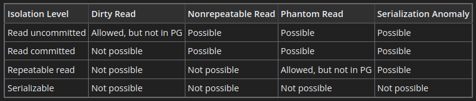

# PostgreSQL Theory

## Mục lục
- [Overview](#overview)
- [Các thành phần chính trong PostgreSQL](#các-thành-phần-chính-trong-postgresql)
    - [I. Cluster](#i-cluster)
    - [II. Database](#ii-database)
    - [III. Schema](#iii-schema)
    - [IV. Table](#iv-table)
      - [1. Overview](#1-overview)
      - [2. Default value](#2-default-value)
      - [3. Generated column](#3-generated-column)
      - [4. Constraint](#4-constraint)
      - [5. Thay đổi cấu trúc của một bảng](#5-thay-đổi-cấu-trúc-của-một-bảng)
- [Data Manipulation Language (DML)](#data-manipulation-language-dml)
  - [1. Insert](#1-insert)
  - [2. Update](#2-update)
  - [3. Delete](#3-delete)
- [Queries (Truy vấn)](#queries-truy-vấn)
  - [1. Overview](#1-overview-1)
  - [2. SELECT](#2-select)
  - [3. FROM và JOIN](#3-from-và-join)
  - [4. WHERE](#4-where)
  - [5. GROUP BY và HAVING](#5-group-by-và-having)
  - [6. Aggregate Function](#6-aggregate-function)
  - [7. ORDER BY](#7-order-by)
  - [8. Thứ tự thực thi tổng quát của một truy vấn](#8-thứ-tự-thực-thi-tổng-quát-của-một-truy-vấn)
  - [9. Subquery](#9-subquery)
- [Index](#index)
    - [1. Overview](#1-overview-2)
    - [2. Các loại index trong PostgreSQL](#2-các-loại-index-trong-postgresql)
- [Partitioning](#partitioning)
    - [1. Overview](#1-overview-3)
    - [2. Horizontal partitioning](#2-horizontal-partitioning)
    - [3. Vertical partitioning](#3-vertical-partitioning)
- [Transaction](#transaction)
    - [1. Overview](#1-overview-4)
    - [2. Atomicity (Tính nguyên tử)](#2-atomicity-tính-nguyên-tử)
    - [3. Consistency (Tính nhất quán)](#3-consistency-tính-nhất-quán)
    - [4. Isolation (Tính cô lập)](#4-isolation-tính-cô-lập)
    - [5. Durability (Tính bền vững)](#5-durability-tính-bền-vững)


## Overview

## Các thành phần chính trong PostgreSQL

- PostgreSQL tổ chức dữ liệu theo một cấu trúc phân cấp rõ ràng, bao gồm cluster, database, schema, table,...

    

### I. Cluster

- Cluster là đơn vị lưu trữ lớn nhất trong PostgreSQL, là một tập hợp các cơ sở dữ liệu được quản lý bởi một server PostgreSQL.

### II. Database

- Database là một tập hợp các schema, mỗi schema chứa các table và các đối tượng khác.
- Mỗi database trong PostgreSQL là một thực thể độc lập với các schema và table riêng.
- Các database khác nhau trong cùng một cluster không chia sẻ dữ liệu trực tiếp với nhau.
- Người dùng sẽ phải kết nối đến một database cụ thể khi sử dụng PostgreSQL.
- Khi PostgreSQL được khởi tạo, mặc định sẽ có 3 database được tạo ra, `template0` và `template1` là các database mẫu cho việc tạo database mới còn `postgres` là database mặc định trong PostgreSQL.
- Kết nối và chuyển đổi database
    ```sgl
    -- Hiển thị tất cả databases
    \l

    -- Kết nối đến database
    \c ten_database
    ```
- Tạo database mới
    ```sql
    CREATE DATABASE database_name;
    ```
- Xóa database
    ```sql
    DROP DATABASE database_name;
    ```
    - Chỉ những user sở hữu database hoặc superuser mới có quyền xóa database đó.
    - Xóa 1 database cũng sẽ xóa sạch tất cả các đối tượng chứa trong database đó.
    - Không thể thực thi câu lệnh `DROP DATABASE` khi ta đang kết nối đến database cần xóa. Cần phải kết nối đến một database khác rồi mới tiến hành thực thi câu lệnh xóa database kia.

### III. Schema

- Schema là một không gian chứa các đối tượng trong cơ sở dữ liệu như table, view, index,...
- Schema giúp tổ chức, quản lý và nhóm các đối tượng trong database theo logic.
- Các đối tượng ở các schema khác nhau có thể có cùng tên mà không gây xung đột.
- Mặc định, PostgreSQL tạo một schema có tên `public` cho mỗi cơ sở dữ liệu mới.
- Tạo một schema mới
    ```sql
    CREATE SCHEMA schema_name;
    ```
- Xóa một schema
    ```sql
    -- Chỉ xóa schema nếu nó trống
    DROP SCHEMA schema_name;

    -- Xóa schema và tất cả các đối tượng trong nó
    DROP SCHEMA schema_name CASCADE;
    ```
- Để truy cập 1 đối tượng trong schema, ta dùng cấu trúc `<tên Schema>.<tên đối tượng>`.
- `search_path` là tham số quy định danh sách schema mà PostgreSQL sẽ sử dụng để tìm hay tạo 1 đối tượng nào đó khi chúng ta không chỉ rõ schema.
    ```sql
    SHOW search_path ;
    ```
    ```
       search_path   
    -----------------
     "$user", public
    (1 row)
    ```
    - Như ta thấy, `search_path` là 1 danh sách bao gồm: `$user` tức là tên user đang kết nối vào, tiếp theo là `public`. Điều đó có nghĩa là, nếu ta tạo 1 đối tượng mà không chỉ ra schema, PostgreSQL sẽ cố gắng tìm schema có tên trùng với user mà ta dùng để đăng nhập trước đó để đặt đối tượng vào đó, nếu schema đó không tồn tại, nó sẽ tạo đối tượng ở schema tiếp theo trong `search_path`, đó là `public`.
    - Để thay đổi `search_path`, ta dùng câu lệnh
    ```sql
    SET search_path TO schema1, schema2, public;
    ```

### IV. Table

#### 1. Overview

- Table là đối tượng lưu trữ dữ liệu trong PostgreSQL, mỗi table sẽ có một cấu trúc xác định với các cột và kiểu dữ liệu.

- Tạo một table mới
    ```sql
    CREATE TABLE tên_bảng (
        tên_cột1 kiểu_dữ_liệu [CONSTRAINT ràng_buộc],
        tên_cột2 kiểu_dữ_liệu [CONSTRAINT ràng_buộc],
        ...
    );
    ```
    ```sql
    CREATE TABLE IF NOT EXISTS users(
        id TEXT PRIMARY KEY,
        name TEXT NOT NULL,
        date_of_birth DATE,
        gender TEXT,
        email TEXT UNIQUE,
        password TEXT
    );
    ```

- Xóa một bảng
    ```sql
    DROP TABLE ten_bang
    ```

#### 2. Default value

- Một cột (column) trong PostgreSQL có thể được gán một giá trị mặc định (default value). Khi một record được tạo và không có giá trị nào được chỉ định cho cột đó, cột đó sẽ được gán cho giá trị mặc định tương ứng. Nếu không có giá trị mặc định nào được khai báo, giá trị mặc định của cột đó sẽ là `null`.
    ```sql
    CREATE TABLE products (
        product_no integer,
        name text,
        price numeric DEFAULT 9.99
    );
    ```
- Giá trị mặc định có thể là một biểu thức (expression), biểu thức này sẽ được thực thi bất cứ khi nào giá trị mặc định được tạo. Ví dụ, ta có thể đặt giá trị mặc định của một cột có kiểu `timestamp` là `CURRENT_TIMESTAMP` và mỗi khi một `record` mới được tạo, cột này sẽ có giá trị mặc định bằng với thời gian mà `record` được tạo ra.

#### 3. Generated column
- `Generated column` là một cột đặt biệt mà giá trị của cột này luôn được tính toán dựa trên giá trị của các cột khác. Không thể chèn hoặc thay đổi giá trị của `generated column` sử dụng câu lệnh `INSERT` hoặc `UPDATE`.
- Có hai kiểu `generated column`
    - `Stored`: Giá trị của cột được tính toán khi dữ liệu được chèn (`insert`) hoặc cập nhật (`update`), và được lưu trữ trực tiếp trong bảng.
        ```sql
        CREATE TABLE people (
            ...,
            height_cm numeric,
            height_in numeric GENERATED ALWAYS AS (height_cm / 2.54) STORED
        );
        ```
    - `Virtual`: Giá trị của cột được tính toán khi được truy vấn, không được lưu trữ trong bảng.
        ```sql
        CREATE TABLE people (
            ...,
            height_cm numeric,
            height_in numeric GENERATED ALWAYS AS (height_cm / 2.54)
        );
        ```
#### 4. Constraint
- Table có thể có các ràng buộc (`constraint`) như khóa chính, khóa ngoại, và các ràng buộc khác trên một cột (`column constraint`) hay nhiều cột (`table constraint`).
- `Check Constraints` (ràng buộc kiểm tra)
    - Là loại ràng buộc cho phép chúng ta chỉ định giá trị của một cột phải thỏa mãn một yêu cầu hoặc điều kiện cụ thể, nói cách khác, giá trị đó phải thoả mãn một biểu thức boolean.
    - Ví dụ để đảm bảo giá trị của một sản phẩm luôn là một số dương, ta có thể dùng
        ```sql
        CREATE TABLE products (
            product_no integer,
            name text,
            price numeric CHECK positive_price (price > 0)
        );
        ```
    - Khi ta chèn hoặc cập nhật giá trị không thỏa mãn ràng buộc, PostgreSQL sẽ trả về lỗi.
    - Ta có thể đặt tên cho ràng buộc, điều này giúp ta hiểu rõ hơn về lỗi cũng như giúp ta dễ dàng tham chiếu đến ràng buộc này khi cần thay đổi nó.
    - `Check constraint` giúp duy trì tính toàn vẹn của dữ liệu bằng cách ngăn chặn việc chèn hoặc cập nhật các giá trị không hợp lệ, đảm bảo dữ liệu luôn nhất quán.
    
- `Not Null Constraint`
    - Ràng buộc yêu cầu một cột không được có giá trị `NULL`.
        ```sql
        CREATE TABLE products (
            product_no integer NOT NULL,
            name text NOT NULL,
            price numeric
        );
        ```

- `Unique Constraint`
    - Ràng buộc này đảm bảo rằng dữ liệu trong một cột, hoặc trong một nhóm cột, là duy nhất với mọi `record` trong cùng một `table` (không có 2 `record` có cùng một giá trị tại một cột hoặc một nhóm cột).
        ```sql
        CREATE TABLE products (
            product_no integer UNIQUE,
            name text,
            price numeric
        );

        CREATE TABLE example (
            a integer,
            b integer,
            c integer,
            UNIQUE (a, c)
        );
        ```
    - Sử dụng `unique constraint` sẽ tự động tạo một `unique B-tree index` trên một cột hoặc một nhóm cột tương ứng. 
    - Tổng quát thì `unique constraint` sẽ bị vi phạm nếu có nhiều hơn một `record` trong bảng mà giá trị của tất cả các cột được bao gồm trong ràng buộc là giống nhau nhưng hai giá trị `null` không được xem là giống nhau. Điều này có nghĩa là dù ta có dùng `unique constraint` thì vẫn có thể tồn tại hai `record` giống nhau đều có giá trị `null` trong cột sử dụng ràng buộc `unique`. Để thay đổi hành vi này, ta có thể sử dụng `NULLS NOT DISTINCT`
        ```sql
        CREATE TABLE products (
            product_no integer UNIQUE NULLS NOT DISTINCT,
            name text,
            price numeric
        );
        ```

- `Primary Key` (khóa chính)
    - `Primary Key` là một cột hoặc một nhóm các cột (thuộc tính) được sử dụng làm định danh duy nhất cho các record trong cùng một `table`.
    - Đảm bảo giá trị dữ liệu của một trường là duy nhất (`UNIQUE`) và không được null (`NOT NULL`).
    - Sử dụng `primary key` sẽ tự động tạo một `unique B-tree index` trên một cột hoặc một nhóm cột tương ứng. 
    - Mỗi table chỉ có thể có tối đa một `Primary Key`.
        ```sql
        -- Primary key gồm một column
        CREATE TABLE products (
            id SERIAL PRIMARY KEY,
            product_name VARCHAR(100),
            price DECIMAL(10,2)
        );

        -- Primary key gồm nhiều column
        CREATE TABLE order_items (
            order_id INTEGER,
            product_id INTEGER,
            quantity INTEGER,
            PRIMARY KEY (order_id, product_id)
        );
        ```
    
- `Foreign Key` (khóa ngoại)
    - Được sử dụng để đảm bảo mối liên kết với một record trong table khác.
    - Là một cột hoặc nhóm các cột trong một `table` tham chiếu đến khóa chính hoặc các column đảm bảo ràng buộc `UNIQUE` trong một `table` khác. Giá trị trong các cột này phải khớp với các giá trị mà nó tham chiếu đến trong `table` khác.
    - `Foreign Key` có thể chứa giá trị `null`.
    - Ta không thể `insert` một `record` chứa giá trị khóa ngoại không tồn tại trong bảng được tham chiếu đến.
        ```sql
        CREATE TABLE products (
            id SERIAL PRIMARY KEY,
            product_name VARCHAR(100),
            price DECIMAL(10,2)
        );

        CREATE TABLE order_items (
            order_id INTEGER,
            -- Foreign Key gồm một cột 
            product_id INTEGER REFERENCES products (id)
            quantity INTEGER
        );

        CREATE TABLE t1 (
            a integer PRIMARY KEY,
            b integer,
            c integer,
            -- Foreign Key gồm nhiều cột
            FOREIGN KEY (b, c) REFERENCES other_table (c1, c2)
        );
        ```
    - `Cascading Option` là các tùy chọn giúp chúng ta tự động xử lí các dữ liệu liên quan khi dữ liệu được tham chiếu bị xóa hoặc cập nhập.
    - `Cascading Option` sẽ hỗ trợ các tùy chọn cho cả 2 trường hợp `ON DELETE` (khi dữ liệu được tham chiếu đến bị xóa) và `ON UPDATE`(khi dữ liệu được tham chiếu đến đuợc cập nhật).
        - `RESTRICT`: Ngăn cản việc xóa hoặc cập nhật giá trị trong một `record` nếu vẫn còn tồn tại các `record` có `foreign key` tham chiếu đến các giá trị đó.
        - `NO ACTION`: Giống như `RESTRICT` nhưng việc báo lỗi và kiểm tra ràng buộc có thể được lùi tới khi `transaction` commit (bằng cách sự dụng câu lệnh `SET CONSTRAINT` để lùi thời gian kiểm tra rằng buộc trong một `transaction`, đọc thêm ở [đây](https://www.postgresql.org/docs/current/sql-set-constraints.html)). Đây là tùy chọn mặc định nếu không tùy chọn nào được khai báo trong PostgreSQL.
        - `CASCADE`: Khi giá trị được tham chiếu bị xóa hoặc cập nhật thì các `record` tham chiếu đến giá trị này sẽ bị xóa theo hoặc được cập nhật giá trị mới tương ứng.
        - `SET NULL`: Khi giá trị được tham chiếu bị xóa hoặc cập nhật thì các giá trị tham chiếu đến nó sẽ nhận giá trị `null`.
        - `SET DEFAULT`: Khi giá trị tham chiếu bị xóa hoặc cập nhật thì giá trị mới sẽ nhận giá trị mặc định nếu đã khai báo trước đó (sử dụng `default value`).
        ```sql
        CREATE TABLE products (
            product_no integer PRIMARY KEY,
            name text,
            price numeric
        );

        CREATE TABLE orders (
            order_id integer PRIMARY KEY,
            shipping_address text,
            ...
        );

        CREATE TABLE order_items (
            product_no integer REFERENCES products ON DELETE RESTRICT,
            order_id integer REFERENCES orders ON DELETE CASCADE,
            quantity integer,
            PRIMARY KEY (product_no, order_id)
        );
        ```

#### 5. Thay đổi cấu trúc của một bảng
- Thêm một cột (column) vào bảng
    ```sql
    ALTER TABLE products ADD COLUMN description text;
    ```
- Xóa một cột (column) trong bảng
    ```sql
    ALTER TABLE products DROP COLUMN description;
    ```
    - Khi xóa một cột thì PostgreSQL sẽ đồng thời xóa tất cả các `index` và `constraint` liên quan đến cột đó.
- Thêm ràng buộc (`constraint`)
    - Thêm `Check Constraint`
        ```sql
        ALTER TABLE ten_bang ADD CHECK (dieu_kien);

        ALTER TABLE ten_bang
        ADD CONSTRAINT ten_rang_buoc CHECK (dieu_kien);
        ```
    - Thêm ràng buộc `UNIQUE`
        ```sql
        ALTER TABLE ten_bang
        ADD CONSTRAINT ten_rang_buoc UNIQUE (ten_cot);
        ```
    - Thêm ràng buộc `NOT NULL`
        ```sql
        ALTER TABLE ten_bang 
        ALTER COLUMN ten_cot SET NOT NULL;
        ```
    - Thêm khóa chính (`Primary Key`)
        ```sql
        ALTER TABLE ten_bang ADD PRIMARY KEY (ten_cot);

        ALTER TABLE ten_bang
        ADD CONSTRAINT ten_rang_buoc PRIMARY KEY (ten_cot);
        ```
    - Thêm khóa phụ (`Foreign Key`)
        ```sql
        ALTER TABLE ten_bang
        ADD FOREIGN KEY (ten_cot) 
        REFERENCES bang_tham_chieu (cot_tham_chieu) [ON DELETE action] [ON UPDATE action];

        ALTER TABLE ten_bang
        ADD CONSTRAINT ten_rang_buoc FOREIGN KEY (ten_cot) 
        REFERENCES bang_tham_chieu (cot_tham_chieu) [ON DELETE action] [ON UPDATE action];
        ```

    - Khi thêm một ràng buộc trên một số cột thì các dữ liệu đã được lưu trong các cột đó phải thỏa mãn ràng buộc nếu không thì PostgreSQL sẽ báo lỗi. Ví dụ nếu ta thêm ràng buộc `NOT NULL` vào một cột thì tất cả dữ liệu đã được lưu trong cột đó không được có giá trị `null`.
- Xóa ràng buộc
    - Để xóa một ràng buộc thì ta cần phải biết tên của chúng. Dùng câu lệnh `\d ten_bang` để xem thông tin chi tiết về bảng (bao gồm tên các ràng buộc có trong bảng đó).
        ```sql
        ALTER TABLE ten_bang DROP CONSTRAINT ten_rang_buoc;
        ```
    - Vì ràng buộc `NOT NULL` không thể đặt tên nên để xóa ràng buộc này, ta cần dùng
        ```sql
        ALTER TABLE ten_bang ALTER COLUMN ten_cot DROP NOT NULL;
        ```
- Thay đổi giá trị mặc định của một cột
    ```sql
    -- Thay đổi giá trị mặc đinh
    ALTER TABLE ten_bang ALTER COLUMN ten_cot SET DEFAULT gia_tri;

    -- Xóa giá trị mặc định (đặt lại về null)
    ALTER TABLE ten_bang ALTER COLUMN ten_cot DROP DEFAULT;
    ```
- Thay đổi kiểu dữ liệu của một cột
    ```sql
    ALTER TABLE ten_bang ALTER COLUMN ten_cot TYPE kieu_du_lieu_moi;
    ```
    Câu lệnh này chỉ thực hiện thành công chỉ khi tất cả dữ liệu cũ có thể convert thành công sang kiểu dữ liệu mới. Ta có thể thêm `USING` vào để thêm biểu thức tính toán dữ liệu mới dựa trên dữ liệu cũ.
- Đổi tên một cột
    ```sql
    ALTER TABLE ten_bang
    RENAME COLUMN ten_cot_cu TO ten_cot_moi;
    ```
- Đổi tên một bảng
    ```sql
    ALTER TABLE ten_bang_cu RENAME TO ten_bang_moi;
    ```

## Data Manipulation Language (DML)
### 1. Insert
- Để tạo một `record` mới trong bảng, ta sử dụng câu lệnh `INSERT`.
- Cú pháp cơ bản
    ```sql
    INSERT INTO tên_bảng (cột1, cột2, cột3, ...)
    VALUES (giá_trị1, giá_trị2, giá_trị3, ...);
    ```
- Nếu ta có thể bỏ một số cột trong câu lệnh `INSERT` nếu không có dữ liệu cho chúng, các cột này sẽ được gán giá trị mặc định.
- Nếu ta muốn thêm dữ liệu vào các cột theo thứ tự được định nghĩa trong bảng, ta có thể bỏ qua danh sách các cột
    ```sql
    CREATE TABLE products (
        product_no integer,
        name text,
        price numeric
    );

    INSERT INTO products VALUES (1, 'Cheese', 9.99);
    ```
- Ta cũng có thể `INSERT` nhiều `record` trong cùng một câu lệnh
    ```sql
    INSERT INTO products (product_no, name, price) VALUES
        (1, 'Cheese', 9.99),
        (2, 'Bread', 1.99),
        (3, 'Milk', 2.99);
- Ta có thể `INSERT` sử dụng kết quả của một câu lệnh truy cấn dữ liệu
    ```sql
    INSERT INTO products (product_no, name, price)
        SELECT product_no, name, price FROM new_products
        WHERE release_date = 'today';
    ```
- Ta có thể thêm `RETURNING cot1, cot2, ...` hay `RETURING *` vào cuối câu lệnh `INSERT` để xem các `record` được thêm vào bởi câu lệnh này.

### 2. Update
- Ta có thể cập nhật dữ liệu của một cột hay một nhóm cột trong một `record` hay một tập các `record` trong một bảng.
- Cú pháp
    ```sql
    UPDATE tên_bảng
    SET cột1 = giá_trị1,
        cột2 = giá_trị2,
        ...
    WHERE điều_kiện;
    ```
    ```sql
    UPDATE products SET price = price * 1.10;
    ```
- Nếu bỏ `WHERE` thì mọi `record` trong bảng sẽ được cập nhật.
- Ta có thể thêm `RETURNING cot1, cot2, ...` vào cuối câu lệnh để xem các `record` đã được cập nhật.

### 3. Delete
- Ta có thể xóa một `record` hay nhiều `record` sử dụng câu lệnh `DELETE`.
- Cú pháp
    ```sql
    DELETE FROM ten_bang
    WHERE dieu_kien
    ```
    ```sql
    DELETE FROM products WHERE price = 10;
    ```
- Nếu ta bỏ `WHERE` thì mọi `record` trong bảng sẽ bị xóa.
- Ta có thể thêm `RETURNING` để xem các `record` bị xóa.

## Queries (Truy vấn)

### 1. Overview
- Cấu trúc của một truy vấn đọc dữ liệu trong PostgreSQL
    ```sql
    SELECT [ ALL | DISTINCT] column1, column2, ...
    FROM table_name
    WHERE condition
    GROUP BY column1, column2, ...
    HAVING condition
    ORDER BY column1, column2, ... [ASC|DESC]
    LIMIT count OFFSET offset
    ```
    ```sql
    --Trả danh sách chứa id, tên, và số điện thoại của các khách hàng ở Việt Nam, được sắp xếp theo tên.
    SELECT customer_id, customer_name, phone
    FROM customers
    WHERE country = 'Vietnam'
    ORDER BY customer_name
    LIMIT 100;
    ```

### 2. SELECT
- Chỉ định các cột dữ liệu cần trả về, các cột này có thể là tên của các cột cần lấy dữ liệu từ các bảng trong `FROM` hoặc là một biểu thức để biến đổi dữ liệu lấy ra thành các dữ liệu mới.
- Ta có thể gán tên mới cho các cột hoặc biểu thức sử dụng `AS`. Tên mới này sẽ được sử dụng để ghi đè tên cột trong kết quả trả về và có thể sử dụng trong `GROUP BY` và `ORDER BY`. 
    ```sql
    -- Kết quả trả về bao gồm tất cả các cột trong các bảng trong FROM
    SELECT * FROM ...

    -- Lựa chọn các cột để trả về
    SELECT a, b, c FROM ...
    SELECT tbl1.a, tbl2.a, tbl1.b FROM ...

    -- Sử dụng biểu thức làm kết quả trả về
    SELECT a AS value, b + c AS sum FROM ...
    ```
- Ta có thể dùng `SELECT DISTINCT` để loại bỏ các hàng giống nhau trong kết quả trả về.

### 3. FROM và JOIN
- Mệnh đề `FROM` sẽ xác định các nguồn dữ liệu để truy vấn thông tin.
- Các đối tượng trong `FROM` có thể là tên của một `table`, kết quả của một truy vấn con (`subquery`), một cấu trúc `JOIN` hoặc một sự kết hợp phức tạp của các yếu tố này. Kết quả của tập hợp trong `FROM` sẽ là một bảng ảo có thể được sử dụng và biến đổi bởi `WHERE`, `GROUP BY` và `HAVING` để tạo ra kết quả của một truy vấn.
- Ta có thể dùng `AS` để tạm thời đặt tên mới cho bảng trong `FROM`, ta không thể sử dụng tên gốc để tham chiếu đến bảng này trong truy vấn này nữa.
    ```sql
    SELECT * FROM my_table AS m WHERE my_table.a > 5;    -- wrong
    ```
- Các phép `JOIN`:
    - Syntax chung
        ```sql
        t1 join_type t2 [ join_condition ]
        ```
    - `CROSS JOIN`: 
        - `CROSS JOIN` tạo ra tích Descartes giữa hai bảng, nghĩa là mỗi hàng của bảng thứ nhất sẽ được kết hợp với mỗi hàng của bảng thứ hai. Nếu bảng thứ nhất có N hàng và bảng thứ hai có M hàng thì kết quả của phép `JOIN` sẽ tạo ra N * M hàng.
        ```sql
        -- t1 table
         num | name
        -----+------
          1 | a
          2 | b
          3 | c

        -- t2 table
         num | value
        -----+-------
           1 | xxx
           3 | yyy
           5 | zzz

        SELECT * FROM t1 CROSS JOIN t2;

          num | name | num | value
         -----+------+-----+-------
            1 | a    |   1 | xxx
            1 | a    |   3 | yyy
            1 | a    |   5 | zzz
            2 | b    |   1 | xxx
            2 | b    |   3 | yyy
            2 | b    |   5 | zzz
            3 | c    |   1 | xxx
            3 | c    |   3 | yyy
            3 | c    |   5 | zzz

        ```
        - Câu lệnh trên tương tự với `FROM t1,t2`.
    - `INNER JOIN`:
        - Với mỗi hàng R1 trong bảng T1, bảng kết quả `JOIN` sẽ có một hàng là kết hợp của R1 với mỗi hàng trong bảng T2 thỏa mãn các điều kiện `JOIN`. Nói cách khác, `INNER JOIN` sẽ trả về các hàng khớp với điều kiện `JOIN` trong cả hai bảng.
        - Để thêm điều kiện `JOIN` ta dùng `ON` hoặc `USING`
            - `ON`: Sử dụng một biểu thức Boolean giống như trong `WHERE`. Một cặp `record` trong bảng T1 và T2 sẽ được kết hợp với nhau nếu biểu thức này trả về true.
                ```sql
                FROM t1 INNER JOIN t2 ON t1.column = t2.column
                ```
            - `USING`: Là một cách sử dụng ngắn gọn hơn cho `ON` trong trường hợp điều kiện `JOIN` sẽ kết hợp các `record` dựa trên giá trị giống nhau ở hai cột có tên giống nhau trong 2 bảng.
                ```sql
                FROM t1 INNER JOIN t2 USING (a,b)
                --Tương đương với
                FROM t1 INNER JOIN t2 ON t1.a = t2.a AND t1.b = t2.b
                ```
        - Ví dụ về `INNER JOIN`
        ```sql
        -- t1 table
         num | name
        -----+------
          1 | a
          2 | b
          3 | c

        -- t2 table
         num | value
        -----+-------
           1 | xxx
           3 | yyy
           5 | zzz

        SELECT * FROM t1 INNER JOIN t2 ON t1.num = t2.num;

         num | name | num | value
        -----+------+-----+-------
           1 | a    |   1 | xxx
           3 | c    |   3 | yyy    
        ```
    - `LEFT OUTER JOIN`
        - Đầu tiên, phép `INNER JOIN` sẽ được thực hiện, sau đó, với mỗi hàng của bảng thứ nhất mà không khớp với bất kỳ hàng nào trong bảng thứ hai, sẽ tạo ra một hàng kết hợp mà tất cả các thuộc tính trong bảng thứ hai nhận giá trị `null`.
        ```sql
        -- t1 table
         num | name
        -----+------
          1 | a
          2 | b
          3 | c

        -- t2 table
         num | value
        -----+-------
           1 | xxx
           3 | yyy
           5 | zzz

        SELECT * FROM t1 LEFT JOIN t2 ON t1.num = t2.num;

         num | name | num | value
        -----+------+-----+-------
           1 | a    |   1 | xxx
           2 | b    |     |
           3 | c    |   3 | yyy
        ```
    - `RIGHT OUTER JOIN`
        - Đầu tiên, phép `INNER JOIN` sẽ được thực hiện, sau đó, với mỗi hàng của bảng thứ hai mà không khớp với bất kỳ hàng nào trong bảng thứ nhất, sẽ tạo ra một hàng kết hợp mà tất cả các thuộc tính trong bảng thứ nhất nhận giá trị `null`.
        ```sql
        -- t1 table
         num | name
        -----+------
          1 | a
          2 | b
          3 | c

        -- t2 table
         num | value
        -----+-------
           1 | xxx
           3 | yyy
           5 | zzz

        SELECT * FROM t1 RIGHT JOIN t2 ON t1.num = t2.num;

         num | name | num | value
        -----+------+-----+-------
           1 | a    |   1 | xxx
           3 | c    |   3 | yyy
             |      |   5 | zzz
        ```
    - `FULL OUTER JOIN` (`FULL JOIN`)
        - Đầu tiên, phép `INNER JOIN` sẽ được thực hiện, sau đó với mỗi hàng của mỗi bảng mà không khớp với bất kỳ hàng nào của bảng kia, sẽ tạo ra một hàng trong bảng kết hợp và sẽ hiển thị giá trị `null` cho các cột của bảng kia.
        ```sql
        -- t1 table
         num | name
        -----+------
          1 | a
          2 | b
          3 | c

        -- t2 table
         num | value
        -----+-------
           1 | xxx
           3 | yyy
           5 | zzz

        SELECT * FROM t1 FULL JOIN t2 ON t1.num = t2.num;

         num | name | num | value
        -----+------+-----+-------
           1 | a    |   1 | xxx
           2 | b    |     |
           3 | c    |   3 | yyy
             |      |   5 | zzz
        ```
- Các cách thực thi `JOIN` trong PostgreSQL
    - Có 3 cách thực thi `JOIN` trong PostgreSQL là `Nested Loop Join`, `Hash Join` và `Merge Join`. PostgreSQL sẽ tự động lựa chọn phương pháp tối ưu nhất cho từng truy vấn cụ thể.
    - `Nested Loop Join`: 
        - Với mỗi `record` trong bảng thứ nhất, PostgreSQL sẽ kiểm tra so sánh điều kiện `JOIN` với từng `record` trong bảng thứ hai và trả về các `record` phù hợp, nếu bảng thứ nhất có `N record` và bảng thứ hai có `M record` thì độ phức tạp sẽ là `O(N * M)`.
        - Tốc độ có thể được cải thiện nếu có `index` trên các thuộc tính trong điều kiện `JOIN`.
    - `Hash Join`:
        - Đầu tiên, PostgreSQL sẽ xây một `hash table` cho bảng có số lượng `record` nhỏ hơn, sử dụng các thuộc tính trong điều kiên `JOIN` làm `hash keys`. 
        - Sau đó, với mỗi `record` trong bảng còn lại, gíá trị băm (`hash value`) của các thuộc tính `JOIN` sẽ được tính toán và so sánh giá trị lưu trong `hash table`, các `record` có cùng giá trị băm ở hai bảng sẽ được so sánh về kết hợp với nhau để tạo ra kết quả `JOIN`.
    - `Merge Join`:
        - Đầu tiên, cả hai bảng sẽ được sắp xếp dựa trên các thuộc tính trong điều kiện `JOIN`, sau đó, hai bảng sẽ được quét song song để tìm và kết hợp các `record` phù hợp. Mỗi `record` sẽ được scan đúng 1 lần.
        - Bước sắp xếp có thể được tối ưu nếu có `index` trên các thuộc tính trong điều kiện `JOIN`.

    
### 4. WHERE
- Syntax
    ```sql
    WHERE search_condition
    ```
- Điều kiện tìm kiếm có thể là bất kỳ biểu thức nào trả về một giá trị `boolean`.
- PostgreSQL sẽ sử dụng điều kiện tìm kiếm này để lọc dữ liệu từ `FROM`.

### 5. GROUP BY và HAVING
- `GROUP BY` được sử dụng để nhóm các hàng có cùng giá trị trong các cột được chỉ định. Điều này cho phép ta sử dụng các hàm tổng hợp `aggregate function` cho mỗi nhóm thay vì toàn bộ bảng.
- Khi sử dụng `GROUP BY`, mỗi cột trong `SELECT` phải là một cột xuất hiện trong mệnh đề `GROUP BY` hoặc là một biểu thức tính toán hay tổng hợp kết quả.
    ```sql
    SELECT * FROM test1;
     x | y
    ---+---
     a | 3
     c | 2
     b | 5
     a | 1

    -- Nhóm theo giá trị x và tính tổng giá trị y cho mỗi nhóm
    SELECT x, sum(y) FROM test1 GROUP BY x;
     x | sum
    ---+-----
     a |   4
     b |   5
     c |   2
    ```
- `HAVING` được sử dụng để lọc kết quả đã được nhóm bởi `GROUP BY`. Nó hoạt động tương tự như `WHERE` nhưng áp dụng cho các nhóm, không phải cho từng hàng riêng lẻ.
    ```sql
    SELECT * FROM test1;
     x | y
    ---+---
     a | 3
     c | 2
     b | 5
     a | 1

    -- Lọc ra các nhóm có tổng y > 3.
    SELECT x, sum(y) FROM test1 GROUP BY x HAVING sum(y) > 3;
     x | sum
    ---+-----
     a |   4
     b |   5
    ```

### 6. Aggregate Function

- Hàm tổng hợp `aggregate function` là các hàm đặc biệt trong PostgreSQL dùng để thực hiện các phép tính trên nhiều hàng dữ liệu và trả về một kết quả duy nhất.
- Hàm tổng hợp có thể sử dụng để tính toán, tổng hợp kết quả từ nhiều `record` hoặc sử dụng kết hợp với `GROUP BY` để tổng hợp dữ liệu theo từng nhóm riêng biệt và có thể sử dụng trong `HAVING` để sàng lọc các nhóm trong `GROUP BY`.
- Hàm tổng hợp không thể sử dụng trong `WHERE` vì `WHERE` sẽ được thực thi và lọc dữ liệu trước khi `GROUP BY` và các hàm tổng hợp được thực thi còn `HAVING` sử dụng được các hàm này vì nó sẽ lọc các nhóm sau khi PostgreSQL xử lý xong `GROUP BY` và tính toán các hàm tổng hợp.
- Một số hàm tổng hợp phổ biến
    - `COUNT()`: Đếm số lượng hàng hoặc giá trị không `null` trong cột.
        ```sql
        -- Đếm số lượng hàng trong bảng
        SELECT COUNT(*) FROM users;

        -- Đếm số lượng giá trị không null trong cột email
        SELECT COUNT(email) FROM users;

        -- Đếm số lượng giá trị duy nhất
        SELECT COUNT(DISTINCT city) FROM users;
        ```
    - `AVG()`: Tính trung bình của các giá trị trong một cột.
        ```sql
        -- Tính lương trung bình theo từng phòng ban
        SELECT department_id, AVG(salary) AS average_salary 
        FROM employees 
        GROUP BY department_id;
        ```
    - `MIN() và  MAX()`: Tìm giá trị nhỏ nhất và lớn nhất trong một cột.
        ```sql
        -- Tìm lương thấp nhất và cao nhất theo từng phòng ban
        SELECT department_id, MIN(salary) AS min_salary, MAX(salary) AS max_salary 
        FROM employees 
        GROUP BY department_id;
        ```
- Ta có thể đọc thêm các hàm tổng hợp được PostgreSQL hỗ trợ tại [đây](https://www.postgresql.org/docs/current/functions-aggregate.html#FUNCTIONS-ORDEREDSET-TABLE).

### 7. ORDER BY

- `ORDER BY` được sử dụng để sắp xếp kết quả của truy vấn theo một hoặc nhiều cột hay theo kết quả của một biểu thức. Nếu không sử dụng, kết quả của truy vấn sẽ được trả về theo thứ tự bất kỳ.
- Syntax
    ```sql
    SELECT select_list
    FROM table_expression
    ORDER BY sort_expression1 [ASC | DESC] [NULLS { FIRST | LAST }]
             [, sort_expression2 [ASC | DESC] [NULLS { FIRST | LAST }] ...]
    ```
- PostgreSQL sắp xếp kết quả dựa trên các biểu thức sắp xếp (sort expression) được chỉ định. Mặc định, dữ liệu được sắp xếp theo thứ tự tăng dần (ASC). Ta có thể sử dụng nhiều tiêu chí sắp xếp, PostgreSQL sẽ áp dụng theo thứ tự từ trái sang phải.
    ```sql
    -- Sắp xếp danh sách nhân viên theo lương tăng dần
    SELECT employee_id, first_name, last_name, salary 
    FROM employees 
    ORDER BY salary;
    ```
- `NULL LAST` và `NULL FIRST` là 2 option có thể được sử dụng để đặt các hàng chứa giá trị `null` lên đầu hoặc cuối kết quả. Mặc định, giá trị `null` được coi như là lớn hơn bất kỳ một giá trị không `null` , vậy nên `NULL FIRST` là mặc định với `DESC` còn `NULL LAST` là mặc định với `ASC`.
- Các lựa chọn như `NULL FIRST`, `ASC`,... là độc lập với mỗi biểu thức sắp xếp. Ví dụ với câu lệnh `ORDER BY x, y DESC` sẽ có nghĩa là `ORDER BY x ASC, y DESC` chứ không phải `ORDER BY x DESC, y DESC`.

### 8. Thứ tự thực thi tổng quát của một truy vấn
- `FROM`: Đầu tiên, PostgreSQL sẽ xác định tất cả các bảng cần đọc dữ liệu trong mệnh đề `FROM` và tiến hành thực hiện các phép `JOIN` nếu có.
- `WHERE`: Sau khi đã có dữ liệu từ `FROM/JOIN`, PostgreSQL sẽ sử dụng các điều kiện có trong `WHERE` để tiến hành lọc dữ liệu, các hàng không thỏa mãn sẽ bị loại.
- `GROUP BY`: Các dữ liệu được lọc ra từ `WHERE` sẽ được nhóm lại theo giá trị của các cột được chỉ định trong `GROUP BY`. Sau đó, các hàm tổng hợp (`aggregate function`) như `SUM`, `AVG`, `COUNT`,... sẽ được thực thi nếu có.
- `HAVING`: Sau khi nhóm dữ liệu, PostgreSQL áp dụng các điều kiện trong mệnh đề `HAVING` để lọc và loại bỏ các nhóm không đáp ứng yêu cầu.
- `SELECT`: Từ dữ liệu trên, PostgreSQL sẽ chọn ra các cột, thực thi và tính toán các biểu thức có trong mệnh đề `SELECT` để tạo ra các hàng trong output.
- `DISTINC`: Tiếp theo, nếu sử dụng từ khóa `DISTINC`, PostgreSQL sẽ loại bỏ các hàm trùng lặp từ kết quả.
- `ORDER BY`: Tiếp theo, nếu sử dụng `ORDER BY`, các hàng trả về sẽ được sắp xếp theo thứ tự chỉ định.
- `LIMIT/OFFSET`: Cuối cùng, PostgreSQL sẽ giới hạn số lượng hàng trả về (`LIMIT`) và bỏ qua một số hàng từ vị trí đầu tiên (`OFFSET`) nếu có.

### 9. Subquery
- `Subquery` (truy vấn con) là một truy vấn được nhúng vào bên trong một truy vấn lớn hơn, cho phép ta sử dụng kết quả của một truy vấn khác bên trong truy vấn hiện tại.
- Các loại `Subquery`
    - `Scalar Subquery`: Là các truy vấn con trả về một giá trị duy nhất (kết quả trả về gồm một hàng và một cột), có thể được sử dụng ở bất kỳ vị trí nào đại diện cho một giá trị duy nhất.
        ```sql
        -- Trả về thông tin của nhân viên có mức lương cao hơn trung bình.
        SELECT name, salary 
        FROM employees
        WHERE salary > (SELECT AVG(salary) FROM employees);

        ```
    - `Single Row Subquery`: Là các truy vấn con trả về một hàng với nhiều cột, nó cho phép so sánh nhiều giá trị cùng lúc.
        ```sql
        -- Trả về thông tin nhân viên có mức lương cao nhất trong phòng ban có id = 5
        SELECT *
        FROM employee
        WHERE (department_id, salary) = (SELECT department_id, MAX(salary)
                                        FROM employee
                                        GROUP BY department_id
                                        HAVING department_id = 5);
        ```
    - `Multiple Row Subquery`
        - Là các truy vấn con trả về nhiều hàng.
        - Thường được sử dụng với các toán tử như `IN, ANY, ALL, SOME` và có thể được sử dụng trong mệnh đê `FROM`, khi đó kết quả của truy vấn con được xem như một bảng tạm thời.
            ```sql
            -- Tính số lượng nhân viên và mức lương trung bình cho mỗi phòng ban
            SELECT d.department_name,
                emp_stats.employee_count,
                emp_stats.avg_salary
            FROM department d
            JOIN (
                SELECT department_id,
                    COUNT(*) AS employee_count,
                    AVG(salary) AS avg_salary
                FROM employee
                GROUP BY department_id
            ) AS emp_stats ON d.department_id = emp_stats.department_id;
            ```
    - `Correlated Subquery`
        - Là các truy vấn con tham chiếu đến bảng trong truy vấn chính. Truy vấn con được thực thi một lần cho mỗi hàng được xử lý bởi truy vấn chính.
            ```sql
            -- Tìm phòng ban không có nhân viên nào
            SELECT d.department_id, d.department_name
            FROM department d
            WHERE NOT EXISTS (
                SELECT 1
                FROM employee e
                WHERE e.department_id = d.department_id
            );
            ```
        - Chậm hơn các `non-correlated subquery` (các truy vấn con không tham chiếu đến bảng trong truy vấn chính) vì các truy vấn này thường sẽ được thực thi đúng 1 lần.
- Các toán tử sử dụng với `subquery`
    - `EXIST`: 
        - Sử dụng để kiểm tra xem `subquery` có trả về bất kỳ dữ liệu nào không. Nếu có ít nhất 1 hàng được trả về từ `subquery`, `EXIST` sẽ trả về `true`, nếu không nó sẽ trả về `false`.
        - Vì kết quả của `EXIST` chỉ phụ thuộc vào việc có dữ liệu được trả về hay không mà không phụ thuộc vào giá trị của dữ liệu nên theo `convention` ta nên dùng `EXISTS(SELECT 1 WHERE ...)`.

            ```sql
            SELECT col1
            FROM tab1
            WHERE EXISTS (SELECT 1 FROM tab2 WHERE col2 = tab1.col2);
            ```

    - `IN/NOT IN`:
        - `IN`: Kiểm tra xem một giá trị có thuộc tập hợp kết quả của subquery không.
        - `NOT IN`: Kiểm tra xem một giá trị có không thuộc tập hợp kết quả của subquery không.
        ```sql
        SELECT * FROM employees 
        WHERE department_id IN (SELECT id FROM departments WHERE location = 'New York');
        ```
    - `ANY/SOME`:
        - So sánh một giá trị với từng giá trị trả về từ `subquery`, toán tử này trả về `true` nếu có bất kỳ giá trị nào thỏa mãn điều kiện so sánh, trả về `false` nếu không có giá trị nào thỏa mãn.
            ```sql
            -- Tìm nhân viên có lương cao hơn ít nhất MỘT nhân viên ở phòng 'Sales'
            SELECT * FROM employee
            WHERE salary > ANY (SELECT salary FROM employee WHERE department = 'Sales');
            ```
    - `ALL`:
        - So sánh một giá trị với từng giá trị trả về từ `subquery`, toán tử này trả về `true` nếu tất cả giá trị nào thỏa mãn điều kiện so sánh, trả về `false` nếu tồn tại giá trị không thỏa mãn.
            ```sql
            -- Tìm nhân viên có lương cao hơn lương của TẤT CẢ nhân viên ở phòng 'Sales'
            SELECT * FROM employee
            WHERE salary > ALL (SELECT salary FROM employee WHERE department = 'Sales');
            ```

## Index
### 1. Overview
- `Index` là một cấu trúc dữ liệu đặc biệt được tạo ra để cải thiện hiệu suất truy vấn dữ liệu.
- Khi PostgreSQL thực hiện tìm kiếm dữ liệu, nó sẽ scan toàn bộ bảng, đọc dữ liệu của từng row trong bộ nhớ từ đầu đến cuối, so sánh với các điều kiện (nếu có) và trả về kết quả. Vì vậy, thời gian tìm kiếm sẽ phụ thuộc vào số lượng `record` trong bảng (O(n)). Cách đọc dữ liệu này còn được gọi là `full scan` hay hoặc `sequential scan`.
- Việc scan toàn bộ bảng để tìm kiếm chỉ phù hợp với những bảng có số lượng `record` nhỏ. Với những bảng chứa một lượng lớn dữ liệu với hàng trăm nghìn cho đến hàng triệu `record` trở lên, việc tìm kiếm sẽ mất rất nhiều thời gian.
- Để giải quyết vấn đề này, ta có thể xây dựng `index` dựa trên một hoặc một nhóm các thuộc tính (`column`). `Index` sẽ chứa giá trị của các thuộc tính này và thông tin về vị trí chính xác của các `record` có giá trị tương ứng trong bộ nhớ.
- Về cơ bản, việc sử dụng `index` là scan đọc dữ liệu trên `index` trước sau đó mới scan và đọc dữ liệu trên bảng gốc. Khi ta thực hiện truy vấn tìm kiếm trên một vài thuộc tính đã được đánh `index`, Postgres sẽ thực hiện `scan index` để tìm vị trí các `record` sau đó thực hiện việc đọc dữ liệu trực tiếp từ bộ nhớ. Việc này nhanh hơn rất nhiều so với `full scan` vì `index` sử dụng các cấu trúc dữ liệu phức tạp để tối ưu việc tìm kiếm dựa trên các thuộc tính được đánh `index` như `B-tree` (cây cân bằng), `Hash`, ...
- Một khi `index` đã được tạo, PostgreSQL sẽ tự động cập nhật `index` khi dữ liệu trong bảng bị thay đổi và nó sẽ sử dụng `index` này trong khi thực thi truy vấn nếu nó nghĩ việc sử dụng sẽ tối ưu hơn là dùng `sequential scan`.
- `Index` sẽ chỉ có tác dụng trên các truy vấn sử dụng điều kiện chứa thuộc tính đã được đánh `index`.
- Để tạo một `index` trong PostgreSQL, ta sử dụng câu lệnh
    ```sql
    CREATE INDEX index_name ON table_name (col_name);
    ```
- Để minh họa về hiệu quả của `index`, ta sẽ sử dụng bảng `engineer` với 100000 `records` (dữ liệu trong file `data.sql`)
    ```sql
    CREATE TABLE IF NOT EXISTS engineer
    (
        id bigserial NOT NULL,
        first_name character varying(255),
        last_name character varying(255),
        gender smallint NOT NULL,
        country_id bigint,
        title character varying(255),
        created timestamp without time zone,
        PRIMARY KEY (id)
    );
    ```

- Đầu tiên, ta phân tích câu lệnh truy vấn dữ liệu trước khi thêm `index`
    ```sql
    EXPLAIN ANALYZE SELECT * FROM engineer WHERE country_id >= 150;

    QUERY PLAN                                                   
    ------------------------------------------------------------
    Seq Scan on engineer  (cost=0.00..2367.00 rows=37876 width=52) (actual time=0.016..15.220 rows=37759 loops=1)
        Filter: (country_id >= 150)
        Rows Removed by Filter: 62241
    Planning Time: 0.320 ms
    Execution Time: 17.122 ms
    ```
    Ta có thể thấy, vì chưa tạo `index`, PostgreSQL sẽ sử dụng `sequential scan` để scan toàn bộ bảng để tìm kiếm dữ liệu.
- Tiếp theo, ta tạo `index` trên thuộc tính `country_id` và chạy lại câu truy vấn
    ```sql
    CREATE INDEX idx_engineer_country_id ON engineer(country_id);

    EXPLAIN ANALYZE SELECT * FROM engineer WHERE country_id >= 150;

    QUERY PLAN                                                                
    ------------------------------------------------------------
    Bitmap Heap Scan on engineer  (cost=425.83..2016.28 rows=37876 width=52) (actual time=2.115..8.779 rows=37759 loops=1)
        Recheck Cond: (country_id >= 150)
        Heap Blocks: exact=1117
        ->  Bitmap Index Scan on idx_engineer_country_id  (cost=0.00..416.36 rows=37876 width=0) (actual time=1.917..1.917 rows=37759 loops=1)
            Index Cond: (country_id >= 150)
    Planning Time: 0.188 ms
    Execution Time: 10.889 ms
    ```
    Ta có thể thấy, sau khi áp dụng `index`, PostgreSQL đã sử dụng `index scan` thay vì `sequential scan` và thời gian thực thi truy vấn giảm hơn 40% từ `17ms` xuống còn `10ms`.

- Ta xét một câu truy vấn khác với `country_id >= 100`
    ```sql
    EXPLAIN ANALYZE SELECT * FROM engineer WHERE country_id >= 100;

    ------------------------------------------------------------
    Seq Scan on engineer  (cost=0.00..2367.00 rows=58538 width=52) (actual time=0.023..9.260 rows=58497 loops=1)
        Filter: (country_id >= 100)
        Rows Removed by Filter: 41503
    Planning Time: 0.129 ms
    Execution Time: 11.330 ms
    ```
- Trong ví dụ này, mặc dù đã có `index` trên thuộc tính `country_id` nhưng PostgreSQL vẫn quyết định dùng `seq scan` vì với điều kiện này, sẽ có rất nhiều `record` phù hợp. Vậy nên, PostgreSQL xác định rằng `seq scan` trên bảng chính còn nhanh hơn việc `scan index` rồi sau đó mới đọc dữ liệu từ bảng chính.
- Như vậy, với mỗi điều kiện tìm kiếm khác nhau, PostgreSQL sẽ biết cách thực hiện các `query` nhanh nhất có thể dựa trên những gì chúng ta cung cấp cho nó, cụ thể ở đây là `index`.
- Các dữ liệu trong `index` phải đồng bộ so với bảng chính, vậy nên việc thay đổi dữ liệu (thêm, sửa, xóa) sẽ bị chậm đi do phải cập nhật cả `index` và việc `index` không phải lúc nào cũng tăng tốc độ tìm kiếm dữ liệu nên ta không nên sử dụng `index` một cách tùy tiện, có thể không làm tăng tốc độ đọc mà còn làm giảm tốc độ viết và ghi dữ liệu. 

### 2. Các loại index trong PostgreSQL

- PostgreSQL hỗ trợ nhiều loại `index` như `B-Tree`, `Hash`, `Gist`, ... Mỗi loại `index` sử dụng các cấu trúc dữ liệu và thuật toán khác nhau phù hợp cho các kiểu tìm kiếm và kiểu dữ liệu khác nhau.
- Mặc định, nếu không chỉ định loại `index` khi tạo thì PostgreSQL sẽ luôn sử dụng `B-tree index`, loại `index` sẽ phù hợp với hầu hết các trường hợp phổ biến.

- `B-tree` (cây cân bằng)
    - Là loại `index` hỗ trợ tối ưu tìm kiếm với các toán tử `<   <=   =   >=   >`.
    - Hiệu quả trong việc tìm kiếm khoảng giá trị (range queries).
    ```sql
    CREATE INDEX index_name ON table_name (col_name);
    ```

- `Hash`
    - Sử dụng `hash function` trên các thuộc tính `index` để tạo `index table`.
    - Chỉ áp dụng trong các câu truy vấn sử dụng so sánh `=`.
    - Không thể xây dựng `composite index` (`index` xây dựng dựa trên nhiều thuộc tính) sử dụng `Hash`.
    ```sql
    CREATE INDEX index_name ON table_name USING HASH (col_name);
    ```

- Ngoài hai kiểu `index` phổ biến trên, PostgreSQL còn hỗ trợ các loại `index` khác như `GiST`, `SP-GiST`, `GIN` và `BRIN`. Đọc thêm về các loại `index` này ở [đây](https://www.postgresql.org/docs/current/indexes-types.html).

## Partitioning

### 1. Overview
- `Partitioning` (phân vùng dữ liệu) là việc chia một bảng lớn (`partitioned table`) thành nhiều bảng nhỏ hơn gọi là các `partition`. Mỗi `partition` là một bảng riêng biệt nhưng khi truy vấn, người dùng vẫn tương tác với bảng chính như một khối dữ liệu thống nhất. PostgreSQL sẽ tự động chuyển các truy vấn đến đúng phân vùng chứa dữ liệu cần xử lý. 
- `Partitioning` thường được sử dụng để phân chia một bảng chứa các khối dữ liệu cực kì lớn vượt quá bộ nhớ lưu trữ của `server`.
- `Partitioning` có thể làm tăng hiệu suất truy vấn sử dụng các thuộc tính trong `partition key` làm điều kiện tìm kiếm bằng cách giảm không gian tìm kiếm và có thể tối ưu lưu trữ bằng cách lưu các dữ liệu của phân vùng ít được truy cập ở các thiết bị lưu trữ chậm hơn nhưng rẻ hơn.
- Trong PostgreSQL, ta không thể biến một bảng bình thường đã được khai báo thành bảng có thể phân vùng `partitioned table`.

### 2. Horizontal partitioning
- Là kĩ thuật chia một bảng lớn thành các bảng nhỏ hơn theo chiều ngang, mỗi bảng con sẽ kế thừa toàn bộ cấu trúc của bảng cha, từ `column` cho đến kiểu dữ liệu. Các dữ liệu sẽ được phân chia vào mỗi bảng theo điều kiện phân vùng `partition keys`.
    
- PostgreSQL hỗ trợ chúng ta 3 kiểu `horizontal partitioning` là `partition by range`, `partition by list` và `partition by hash`.
- `Partition by range`
    - Phân chia dữ liệu dựa trên một khoảng giá trị liên tục. Ví dụ như phân chia dữ liệu theo khoảng khoảng thời gian, phân chia theo bảng chữ cái A, B, C; D, E, F;... hoặc theo khoảng số liệu (`ID` từ 1-1000, 1001-2000,...).
    - Ví dụ về phân chia bảng `measurement` dựa trên thời gian tạo `record` sử dụng thuộc tính `logdate` làm thuộc tính phân vùng `partiton key`, mỗi `partiton` sẽ chứa dữ liệu trong vòng một tháng.
        ```sql
        CREATE TABLE measurement (
            city_id         int not null,
            logdate         date not null,
            peaktemp        int,
            unitsales       int
        ) PARTITION BY RANGE (logdate);

        CREATE TABLE measurement_y2006m02 PARTITION OF measurement
            FOR VALUES FROM ('2006-02-01') TO ('2006-03-01');

        CREATE TABLE measurement_y2006m03 PARTITION OF measurement
            FOR VALUES FROM ('2006-03-01') TO ('2006-04-01');

        ...
        CREATE TABLE measurement_y2007m11 PARTITION OF measurement
            FOR VALUES FROM ('2007-11-01') TO ('2007-12-01');
        ```
    - Khi ta cố `INSERT` một `record` không thuộc một `partition` nào thì PostgreSQL sẽ báo lỗi vì không biết nên để `record` này vào đâu. Do đó, nếu không chắc chắn về tập data của mình, ta cần tạo một `table default partition` để chứa các `record` không biết phân loại vào đâu.
        ```sql
        CREATE TABLE measurement_default PARTITION OF measurement DEFAULT;
        ```
- `Partition by list`
    - Với `list partitioning` thì việc phân chia dữ liệu sẽ dựa trên một danh sách các giá trị.
    - Ví dụ với bảng `engineer` thì có thể nhóm các `engineer` có title `Backend Engineer`, `Frontend Engineer`, `Fullstack Engineer` nhóm vào thành một `partition`; `BA` và `QA` một `partition`; còn lại là `default partition`. 
        ```sql
        CREATE TABLE ENGINEER
        (
            id bigserial NOT NULL,
            first_name character varying(255) NOT NULL,
            last_name character varying(255) NOT NULL,
            gender smallint NOT NULL,
            country_id bigint NOT NULL,
            title character varying(255) NOT NULL,
            started_date date,
            created timestamp without time zone NOT NULL
        ) PARTITION BY LIST(title);

        CREATE TABLE ENGINEER_ENGINEER PARTITION OF ENGINEER FOR VALUES
            IN ('Backend Engineer', 'Frontend Engineer', 'Fullstack Engineer');

        CREATE TABLE ENGINEER_BA_QA PARTITION OF ENGINEER FOR VALUES
            IN ('BA', 'QA');
            
        CREATE TABLE ENGINEER_DEFAULT PARTITION OF ENGINEER DEFAULT;
        ```
    - `List partition` phân chia `table` dựa trên danh sách các giá trị cho trước, không theo khoảng giá trị như `range partition`. Do đó, nó phù hợp phân chia dữ liệu theo những giá trị cụ thể.
- `Partition by hash`
    - `Hash partitioning` sẽ thực hiện `hash` các giá trị trong `partition keys` để tạo ra `hash value`, sau đó, các giá trị này sẽ được chia dư (`modulus`) để tìm `record` cho `partition`. 
    - Ví dụ `record` có `partition key hash value = 5`, tổng số lượng `partition` là 3 (0, 1, 2), lấy 5 % 3 = 2. Vậy `record` đó nằm ở `partition` thứ ba.
        ```sql
        CREATE TABLE ENGINEER
        (
            id bigserial NOT NULL,
            first_name character varying(255) NOT NULL,
            last_name character varying(255) NOT NULL,
            gender smallint NOT NULL,
            country_id bigint NOT NULL,
            title character varying(255) NOT NULL,
            started_date date,
            created timestamp without time zone NOT NULL
        ) PARTITION BY HASH(country_id);

        CREATE TABLE ENGINEER_P1 PARTITION OF ENGINEER
            FOR VALUES WITH (MODULUS 3, REMAINDER 0);

        CREATE TABLE ENGINEER_P2 PARTITION OF ENGINEER
            FOR VALUES WITH (MODULUS 3, REMAINDER 1);
            
        CREATE TABLE ENGINEER_P3 PARTITION OF ENGINEER
            FOR VALUES WITH (MODULUS 3, REMAINDER 2);
        ```
    - Với `hash partition`, ta không thể dễ dàng đoán được một `record` nằm ở `partition` nào. Vậy nên, `hash partition` phù hợp với các dữ liệu không nhất thiết phải thuộc cùng một nhóm để lưu vào một `partition`.
    - Mục đích của `hash partition` là cố gắng phân chia dữ liệu một các cân bằng giữa các `partition` với nhau.

### 3. Vertical partitioning
- `Vertical partitioning` sẽ chia một bảng thành các `partition` theo chiều dọc. Ta sẽ nhóm các cột có tần suất truy vấn cùng nhau vào một `partition`. Việc này sẽ làm giảm kích thước của `record` khi cần đọc và tăng hiệu suất truy vấn.
    

- Ta thường sẽ sử dụng chung một `primary key` cho toàn bộ các `partition`.

## Transaction

### 1. Overview
- `Transaction` sẽ xử lý một chuỗi các câu lệnh SQL và thực thi nó như một đơn vị thực thi duy nhất. Các câu lệnh trong một `transaction` đều phải được thực thi thành công, nếu có một câu lệnh thực thi không thành công, tất cả các thay đổi trước đó trên dữ liệu trong `transaction` đều sẽ được `rollback` và sẽ không có bất kỳ sự thay đổi nào xảy ra.
- Một `transaction` sẽ bắt đầu với câu lệnh `BEGIN`, nếu tất cả các câu lệnh đều được thực hiện thành công, ta sử dụng `COMMIT` để kết thúc `transaction` và lưu các thay đổi vào database. Ta cũng có thể sử dụng `ROLLBACK` để kết thúc và sẽ không có sự thay đổi nào được lưu vào database.
- `Transaction` phải đảm bảo 4 tính chất `ACID` là `Atomicity`, `Consistency`, `Ísolation` và `Durability`.

### 2. Atomicity (Tính nguyên tử)
- `Atomicity` là tính chất yêu cầu tất cả các bước trong một `transaction` đều phải được thực hiện thành công hoặc không có thay đổi nào xảy ra.
- Nếu có một `transaction` bị lỗi thì `transaction` đó sẽ được `ROLLBACK`, dữ liệu sẽ không thay đổi, còn nếu không xảy ra lỗi thì `transaction` sẽ được `COMMIT`, dữ liệu trong cơ sở dữ liệu sẽ được cập nhật thành công.

### 3. Consistency (Tính nhất quán)
- `Consistency` yêu cầu `transaction` chỉ có thể thay đổi dữ liệu theo những cách được cho phép.
- Dữ liệu trong database luôn phải được đặt trong trạng thái hợp lệ ở bất kỳ thời điểm nào trước và sau khi thực hiện mỗi hành động trong `transaction`.
- Sau khi thực hiện một `transaction`, tất cả các quy định và ràng buộc của cơ sở dữ liệu phải được duy trì. Nếu một `transaction` vi phạm bất kỳ ràng buộc nào, nó phải bị huỷ bỏ và hệ thống phải quay trở lại trạng thái trước khi `transaction` diễn ra.

### 4. Isolation (Tính cô lập)
- `Isolation` nói về tính độc lập của các `transaction` thực thi đồng thời. Tính chất này sẽ đảm bảo các `transaction` có thể hoạt động song song mà không gây ảnh hưởng đến nhau.
- `Read phenomena` là các hiện tượng đọc có thể xảy ra khi các `transaction` hoạt động đồng thời.
    - `Dirty read`: Một `transaction` đọc được những thay đổi dữ liệu chưa được `commit` từ các `transaction` khác. Điều này rất nguy hiểm vì ta không biết rằng các dữ liệu này sẽ được `commit` hay `rollback`.
    - `Nonrepeatable read`: Là hiện tượng khi `transaction` đọc một dữ liệu nhiều lần nhưng nhận được các kết quả khác nhau do một `transaction` khác đã sửa đổi và `commit` dữ liệu đó trong khoảng thời gian giữa các lần đọc.
    - `Phantom read`: Gần giống như `nonrepeatable read` nhưng xảy ra với các truy vấn trả về một tập các dữ liệu. Hiện tượng này xảy ra khi `transaction` thực hiện lại một truy vấn trả về một tập các dữ liệu thỏa mãn điều kiện nào đó và phát hiện ra lần này trả về các hàng khác (nhiều hơn hoặc ít hơn) so với lần đầu tiên. Điều này xảy ra do một `transaction` khác đã thêm hoặc xóa dữ liệu phù hợp với điều kiện truy vấn và `commit` trong khoảng thời gian giữa 2 lần truy vấn.
    - `Serialization anomaly`: Là hiện tượng xảy ra khi kết quả của một nhóm các giao dịch chạy đồng thời sẽ khác với kết quả khi các giao dịch này chạy tuần tự.

- PostgreSQL cung cấp các `isolation level` khác nhau để đảm bảo tính cô lập giữa các `transaction`.
    ```sql
    SET TRANSACTION ISOLATION LEVEL isolation_level;
    ```
    - `Read Uncommitted`:
        - `Transaction` có thể đọc những thay đổi chưa được `commit` hoặc đã được `commit` bởi những `transaction` khác.
        - PostgreSQL không hỗ trợ cấp độ cô lập này, nếu chúng ta đặt `transaction isolation level` là `Read Uncommitted` thì nó sẽ hoạt động như `Read Committed`.
    - `Read Committed`:
        - Các truy vấn bên trong `transaction` chỉ đọc những thay đổi đã được `commit` bởi các `transaction` khác.
        - Đây là `isolation level` mặc định đối với `transaction` trong PostgreSQL.
    - `Repeatable Read`:
        - Mức độ cô lập này đảm bảo khi `transaction` thực hiện một truy vấn thì kết quả của truy vấn này sẽ thống nhất và nhất quán dù được thực hiện lại nhiều lần.
    - `Serializable`:
        - Về cơ bản `serializable` hoạt động giống như `repeatable read` nhưng nó sẽ giám sát việc thực thi các `transaction` đồng thời để xem kết quả tạo ra bởi các `transaction` này có giống như khi chạy tuần tự hay không. Nếu không đảm bảo điều kiện tuần tự thì khi các `transaction` commit, PostgreSQL sẽ cho phép 1 `transaction` chạy thành công và báo lỗi đến các `transaction` còn lại.

    

### 5. Durability (Tính bền vững)
- Tính chất này đảm bảo rằng những `transaction` đã `commit`, kết quả của nó sẽ được lưu trữ vĩnh viễn và không bị mất đi, ngay cả trong trường hợp có lỗi hệ thống, mất điện điện hoặc các sự cố khác.